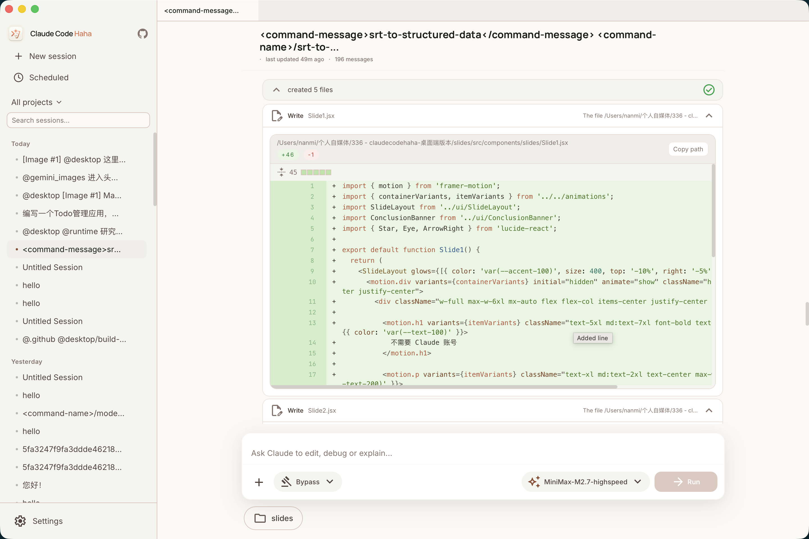
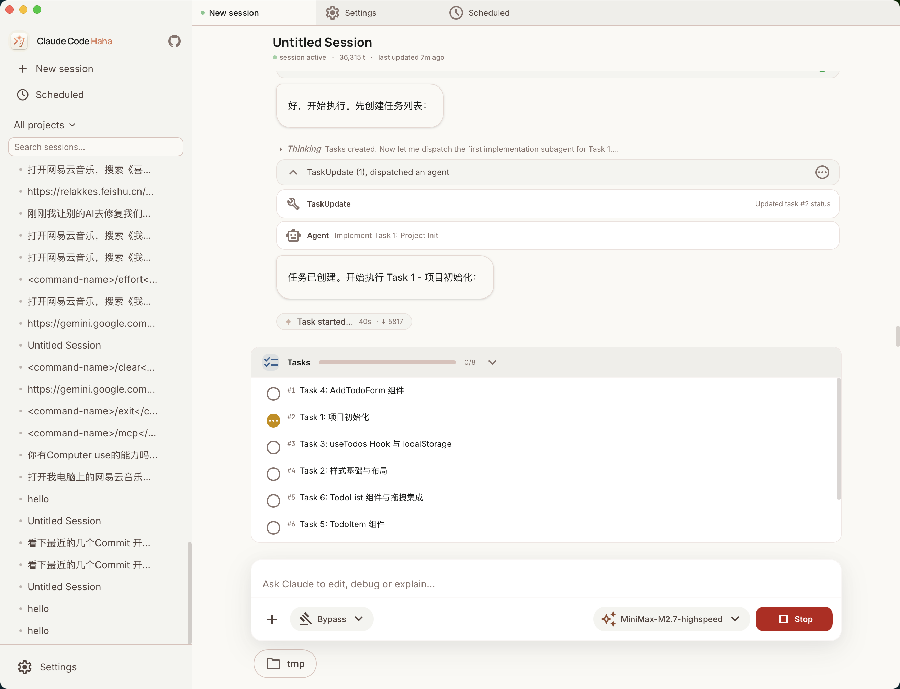
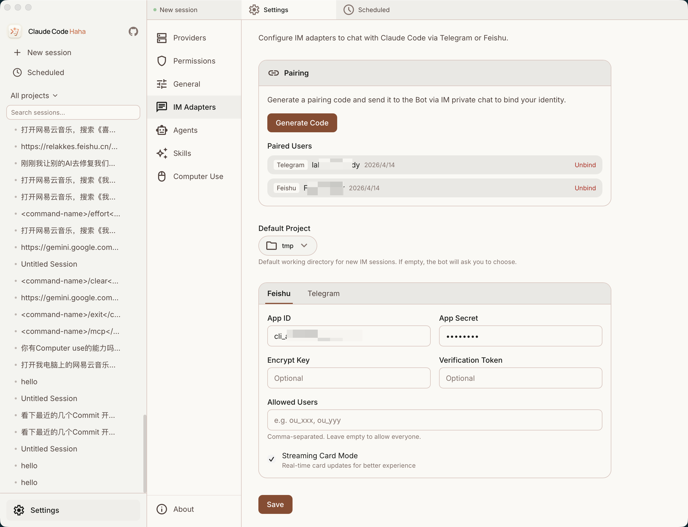
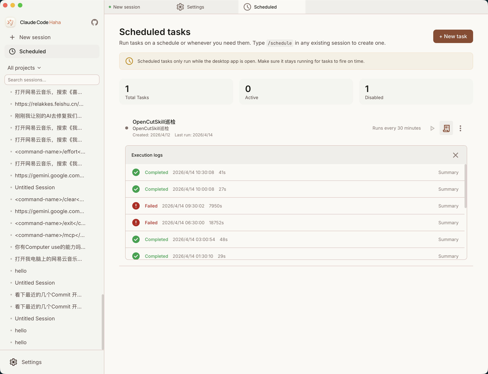
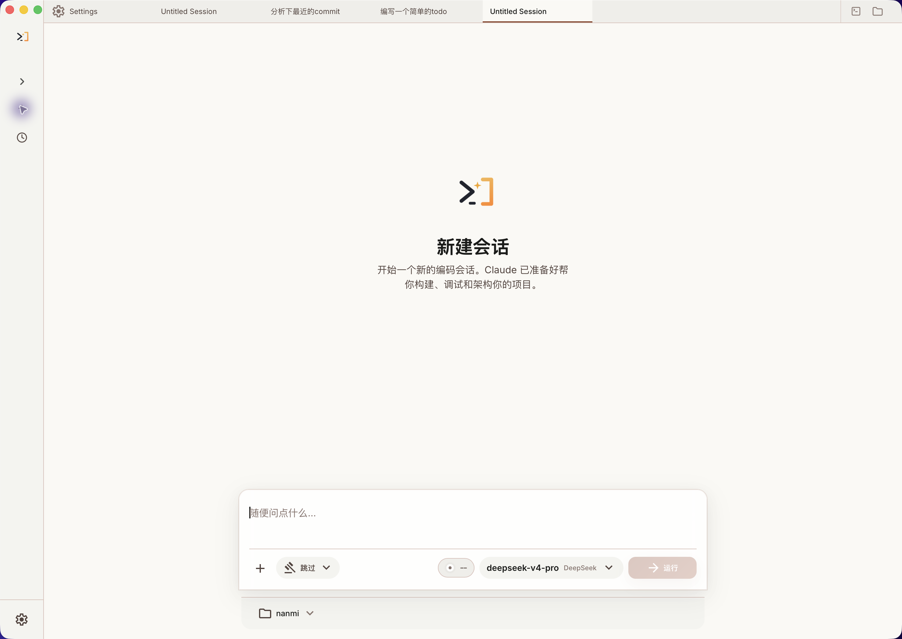
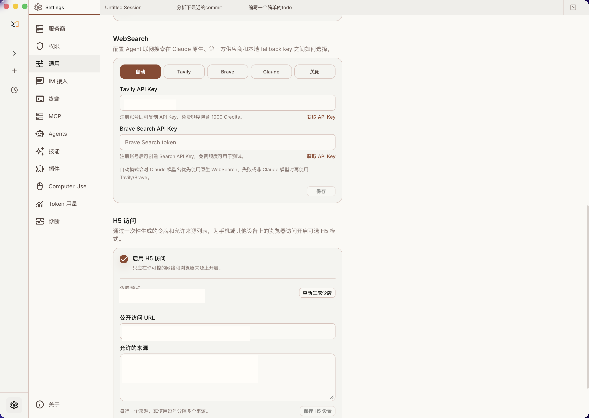

# cchahatui

<p align="center">
  
</p>

<div align="center">

[](https://github.com/funnybomb/cchahatui/releases)
[](https://github.com/funnybomb/cchahatui/releases/tag/v0.3.1)
[](https://github.com/funnybomb/cchahatui/stargazers)
[](#install-the-desktop-app)
[](#deepseek-first)
[](desktop/)
[](LICENSE)
[](README.md)
[](README.en.md)

</div>

cchahatui is a **DeepSeek-first desktop AI coding workspace**. It is developed from the public projects [cc-haha](https://github.com/NanmiCoder/cc-haha) and [DeepSeek-TUI](https://github.com/Hmbown/DeepSeek-TUI), keeping the cc-haha-style session, project, permission, Agent, Skills, plugin, MCP, Computer Use, IM, scheduled task, and token usage workflow while moving the default model experience to DeepSeek V4: long context, streaming reasoning, prefix-cache-aware usage, and an OpenAI-compatible API path.

<p align="center">
  <a href="#deepseek-first">DeepSeek-first</a> ·
  <a href="#project-origin">Project Origin</a> ·
  <a href="#desktop-preview">Desktop Preview</a> ·
  <a href="#install-the-desktop-app">Install</a> ·
  <a href="#more-documentation">More Docs</a>
</p>

---

## DeepSeek-first

| Capability | cchahatui approach |
|------|------|
| Default model | DeepSeek V4 by default, prioritizing `deepseek-v4-pro` / `deepseek-v4-flash` |
| 1M-token context | Built for long-context DeepSeek V4 workflows across large repositories and multi-turn work |
| Streaming reasoning | Displays reasoning/thinking content as it streams into the session UI |
| Prefix-cache awareness | Optimized around DeepSeek prefix caching to reduce repeated context cost and latency |
| OpenAI-compatible | Uses `/chat/completions` compatible paths for direct DeepSeek key setup |
| Claude Code-compatible workflow | Keeps cc-haha / Claude Code-style workflows while shifting branding, configuration, and defaults to cchahatui + DeepSeek |

---

## Project Origin

cchahatui integrates and adapts two public projects:

- [cc-haha](https://github.com/NanmiCoder/cc-haha): desktop workspace, session/project workflow, Agents, Skills, MCP, Computer Use, remote access, IM integration, and scheduled task references.
- [DeepSeek-TUI](https://github.com/Hmbown/DeepSeek-TUI): DeepSeek-first terminal coding agent direction, default model assumptions, and DeepSeek workflow references.

This repository packages those ideas into the independent `cchahatui` desktop product. App name, icon, config directory, default provider, installation docs, and release flow are managed for cchahatui. See [NOTICE.md](NOTICE.md) for upstream acknowledgements.

---

## Desktop Preview

cchahatui brings sessions, multi-project navigation, branch / Worktree controls, right-side file changes, code diffs, permission review, DeepSeek provider setup, and remote access into one graphical workspace for daily development flows beyond the terminal.

<p align="center">
  <a href="https://github.com/funnybomb/cchahatui/releases"></a>
  &nbsp;
  <a href="docs/desktop/04-installation.md"></a>
</p>

<!-- desktop-preview:start -->
<!-- Generated by `npm run docs:update-desktop-preview`. Edit screenshots in `docs/images/desktop_ui/` or labels in `scripts/docs/update-desktop-preview.mjs`. -->
<table>
  <tr>
    <td align="center" width="25%"><br><b>Full Workspace</b></td>
    <td align="center" width="25%"><br><b>Code Editing &amp; Diff</b></td>
    <td align="center" width="25%"><br><b>Permission Review</b></td>
    <td align="center" width="25%"><br><b>Task Todo</b></td>
  </tr>
  <tr>
    <td align="center" width="25%"><br><b>DeepSeek Settings</b></td>
    <td align="center" width="25%"><br><b>Computer Use</b></td>
    <td align="center" width="25%"><br><b>IM Access</b></td>
    <td align="center" width="25%"><br><b>Scheduled Tasks</b></td>
  </tr>
  <tr>
    <td align="center" width="25%"><br><b>File Search</b></td>
    <td align="center" width="25%"><br><b>Slash Commands</b></td>
    <td align="center" width="25%"><br><b>Desktop Workspace</b></td>
    <td align="center" width="25%"><br><b>Token Usage</b></td>
  </tr>
  <tr>
    <td align="center" width="25%"><br><b>H5 Remote Access</b></td>
    <td align="center" width="25%"><br><b>Worktree &amp; Changes</b></td>
  </tr>
</table>
<!-- desktop-preview:end -->

---

## Install the Desktop App

1. Download the macOS or Windows desktop installer from [Releases](https://github.com/funnybomb/cchahatui/releases).
2. On first launch, configure your DeepSeek provider, API key, and default model in Settings.
3. If macOS blocks the app on first open, follow the [desktop installation guide](docs/desktop/04-installation.md) for Gatekeeper steps.

## Run the CLI from Source

For users who want to debug the underlying CLI, server, or local development flow:

```bash
bun install
cp .env.example .env
./bin/claude-haha
```

See [environment variables](docs/en/guide/env-vars.md) and [global usage](docs/en/guide/global-usage.md) for more configuration options.

---

## Desktop Highlights

- **Multi-session workspace**: tabs, project switching, terminal entry, and session history in one place.
- **Branch / Worktree launch**: choose a repository branch and decide whether to use the current working tree or an isolated Worktree.
- **Right-side file changes**: review changed files, added/removed lines, and current workspace state while chatting.
- **Visual code changes**: inspect edits, file writes, and diffs directly in the desktop app.
- **Permission review**: approve risky commands, tool calls, and model follow-up questions in the GUI.
- **DeepSeek-first provider setup**: configure DeepSeek, OpenAI-compatible APIs, WebSearch fallback, and local options.
- **Computer Use**: let the agent take screenshots, click, type, and control desktop apps after authorization.
- **H5 remote access**: open the current desktop session from a phone or another device with a one-time token.
- **IM integration**: chat, switch projects, and approve actions through Telegram / Feishu / WeChat / DingTalk.
- **Scheduled tasks and usage stats**: create planned tasks and track local token usage trends.

---

## More Documentation

| Document | Description |
|------|------|
| [Environment Variables](docs/en/guide/env-vars.md) | Full env var reference and configuration methods |
| [Third-Party Models](docs/en/guide/third-party-models.md) | Using DeepSeek / OpenAI / Ollama and other model providers |
| [Contributing](docs/en/guide/contributing.md) | Local tests, live model baselines, PR gates, and release gates |
| [Memory System](docs/memory/01-usage-guide.md) | Cross-session persistent memory usage and implementation |
| [Multi-Agent System](docs/agent/01-usage-guide.md) | Agent orchestration, parallel tasks and Teams collaboration |
| [Skills System](docs/skills/01-usage-guide.md) | Extensible capability plugins, custom workflows and conditional activation |
| [IM Integration](docs/im/) | Remote chat, project switching, and permission approval via Telegram / Feishu / WeChat / DingTalk |
| [Computer Use](docs/en/features/computer-use.md) | Desktop control (screenshots, mouse, keyboard) — [Architecture](docs/en/features/computer-use-architecture.md) |
| [Desktop App](docs/desktop/) | Tauri 2 + React GUI client — [Quick Start](docs/desktop/01-quick-start.md) \| [Architecture](docs/desktop/02-architecture.md) \| [Installation](docs/desktop/04-installation.md) |
| [Global Usage](docs/en/guide/global-usage.md) | Run claude-haha from any directory |
| [FAQ](docs/en/guide/faq.md) | Common error troubleshooting |
| [Implementation Notes](docs/en/reference/fixes.md) | Compatibility fixes and integration notes inherited from upstream public projects |
| [Project Structure](docs/en/reference/project-structure.md) | Code directory structure |

---

## Sponsorship & Partnership

This project is maintained in the author's spare time. Corporate or individual sponsorships are welcome to support ongoing development. Custom features, integrations, and business partnerships are also open for discussion.

<table>
  <thead>
    <tr>
      <th width="220">Sponsor</th>
      <th align="left">Description</th>
    </tr>
  </thead>
  <tbody>
    <tr>
      <td align="center" valign="middle">
        <a href="https://jiekou.ai/referral?invited_code=OBNU3K">
          <br>
          <strong>接口AI</strong>
        </a>
      </td>
      <td valign="middle">
        Thanks to <a href="https://jiekou.ai/referral?invited_code=OBNU3K">JieKou AI</a> for sponsoring this project. JieKou AI provides official model resources with stable, high-performance API access. Subscription bundles are priced at 20% off the official rate; new users who register through <a href="https://jiekou.ai/referral?invited_code=OBNU3K">this link</a> and bind GitHub can claim a $3 coupon.
      </td>
    </tr>
    <tr>
      <td align="center" valign="middle">
        <a href="https://www.shengsuanyun.com/?from=CH_LEJ88KWR">
          
        </a>
      </td>
      <td valign="middle">
        Thanks to <a href="https://www.shengsuanyun.com/?from=CH_LEJ88KWR">ShengSuanYun</a> for sponsoring this project. ShengSuanYun is an industrial-grade AI task parallel execution platform for AI Native Teams, aggregating Claude, ChatGPT, Gemini, and other LLM, image, and video model capacity through direct, non-reverse-engineered access. Its platform SLA reaches 99.7%, with <a href="https://watch.shengsuanyun.com/status/shengsuanyun">service status</a> available online. It also supports dedicated enterprise gateways, cost and permission controls, smart routing, security protection, BYOK, usage-based billing, upcoming tokens plans, and invoicing. New users registering through <a href="https://www.shengsuanyun.com/?from=CH_LEJ88KWR">this link</a> can receive 10 yuan in model credits plus a 10% first top-up bonus.
      </td>
    </tr>
  </tbody>
</table>

📧 **Contact**: relakkes@gmail.com

---

## ☕ Buy Me a Coffee

If this project helps you, consider buying me a coffee — every bit of support keeps this project going ❤️

<table>
<tr>
<td align="center" width="33%">
<br>
<b>WeChat Pay</b>
</td>
<td align="center" width="33%">
<br>
<b>Alipay</b>
</td>
<td align="center" width="33%">
<a href="https://buymeacoffee.com/relakkes" target="_blank">

</a><br>
<b>Buy Me a Coffee</b>
</td>
</tr>
</table>

---

## Tech Stack

| Category | Technology |
|------|------|
| Language | TypeScript |
| Desktop app | Tauri 2 |
| Desktop UI | React + Vite |
| Local runtime | [Bun](https://bun.sh) |
| Terminal UI | React + [Ink](https://github.com/vadimdemedes/ink) |
| CLI parsing | Commander.js |
| Provider API | DeepSeek / OpenAI-compatible Chat Completions |
| Protocols | MCP, LSP |

## Thanks

Thanks to the following open-source projects and community practices for reference and inspiration:

- [cc-haha](https://github.com/NanmiCoder/cc-haha): desktop AI coding workspace, Agents, Skills, MCP, and local workflow references.
- [DeepSeek-TUI](https://github.com/Hmbown/DeepSeek-TUI): DeepSeek-first terminal coding agent workflow and provider defaults.
- [React](https://github.com/facebook/react): frontend engineering and component-based UI ecosystem.
- [Tauri](https://github.com/tauri-apps/tauri): cross-platform desktop app capabilities and engineering practices.
- [cc-switch](https://github.com/farion1231/cc-switch): reference for model provider configuration.

---

## ⭐ Star History

If this project helps you, please support it with a Star so more people can discover cchahatui.

<a href="https://www.star-history.com/#funnybomb/cchahatui&Date">
  
</a>

---

## License

See [LICENSE](LICENSE) and [NOTICE.md](NOTICE.md).
